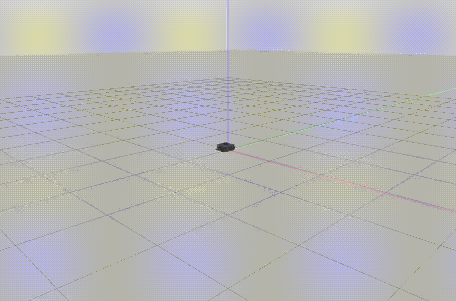
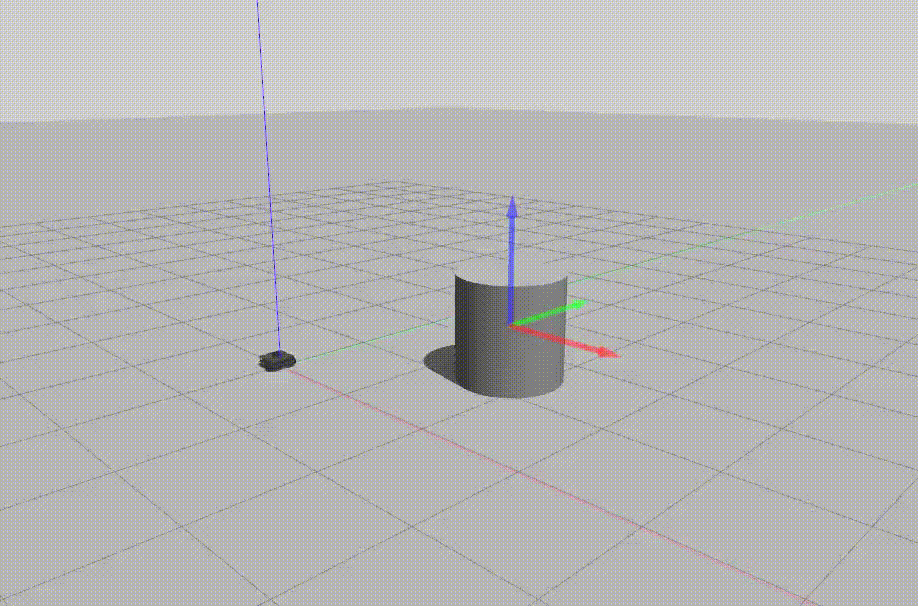

# warmup_project

## Driving in a square 
I use the timing method to let the robot to move in a square once. I use the Twist message to instruct the robot to move forward for a fixed time, then turn for a fixed time such that the total turn roughly matches 90 degree, and repeat this sequence for 4 times.  

The ```init``` function initializes a ros node, set the linear and angular speed and move time respectively, and initializes a Twist message.

The ```run``` function instructs the robot to move forward and turn 90 degree for 4 times, and eventually stops the robot.



## Person follower
The robot drives towards the person and stops in front of him (facing the person).

1. `process_scan` finds the angle closest to the person
2.



## Wall follower
The 


## Challenges
1. In my initial implementation of the *driving in a square* project, the first message couldn't be published. It turned out that it takes time for the publisher to be successfully set up and adding `rospy.sleep(1)` after the initialization of the publisher fixes this. 
2. Couldn't figure out how to set boundary solutions for dealing with corners